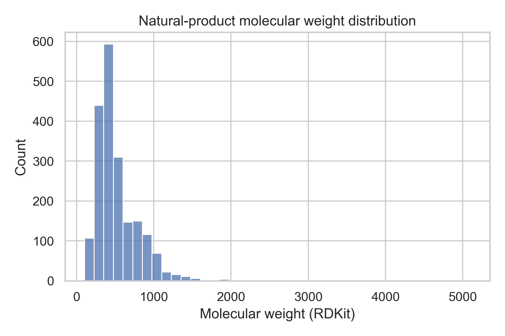
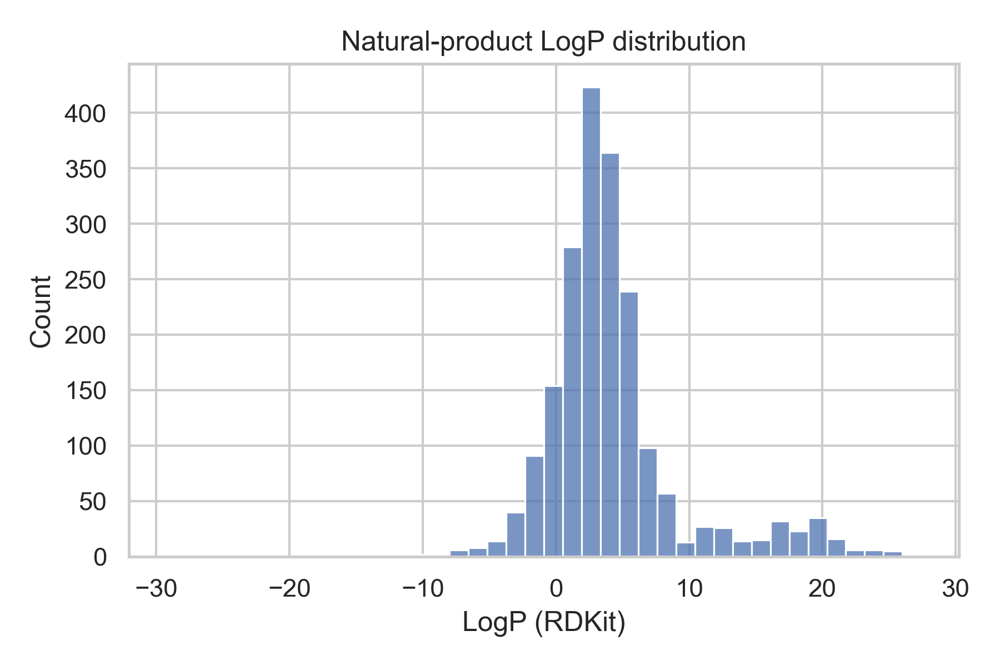
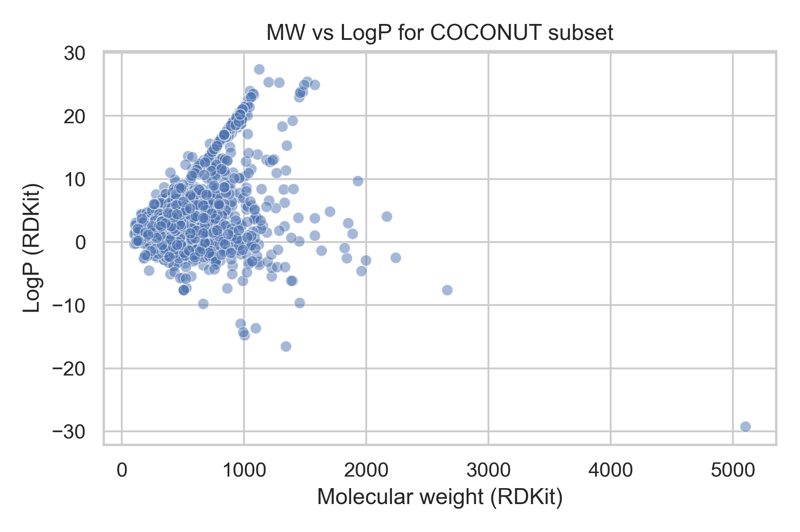
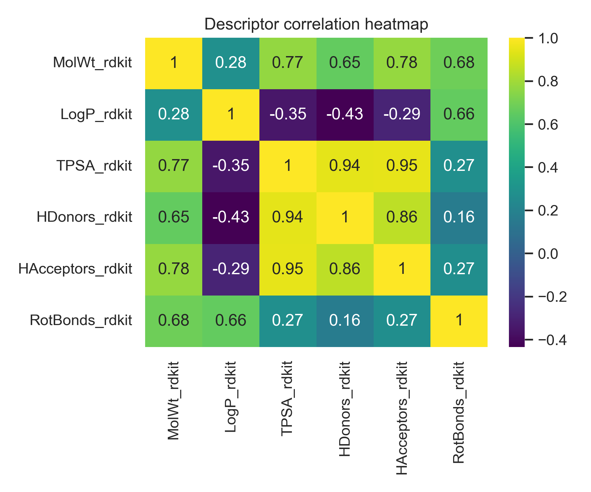

<p align="center">
  
  
  
</p>

# Natural Products Database Analysis

A cheminformatics and data-analysis project using a curated subset of natural products from the COCONUT database. This workflow uses RDKit to parse molecular structures, compute medicinal chemistry–relevant descriptors, and visualize chemical property distributions across a 2,000-compound natural-products dataset.

## Executive Summary

This project was designed to profile the physicochemical space of natural products using a reproducible Python workflow. A subset of 2,000 compounds was sampled from the COCONUT collection, successfully parsed with RDKit, and analyzed using descriptors relevant to molecular property profiling and early-stage drug discovery.

The project demonstrates practical skills in molecular data handling, cheminformatics, descriptor generation, and scientific visualization. It also provides a foundation for downstream workflows such as compound prioritization, clustering, similarity analysis, or lead-like subset selection.

## Key Outcomes

- Built a reproducible RDKit workflow for natural-product descriptor analysis.
- Parsed and analyzed 2,000 natural-product structures with no failed molecules.
- Computed molecular weight, LogP, TPSA, hydrogen-bond counts, and rotatable bond counts.
- Generated publication-style visual summaries of descriptor distributions and relationships.
- Organized outputs into a clean GitHub-ready project structure.

## Scientific Context

Natural products are a rich source of structurally diverse bioactive molecules and remain highly relevant to drug discovery. However, their chemical diversity also makes it important to understand how they are distributed across key physicochemical properties associated with permeability, polarity, lipophilicity, and molecular flexibility.

This project focuses on property profiling rather than bioactivity prediction. By characterizing the descriptor space of a natural-products subset, the workflow helps support later decisions about filtering, prioritization, and medicinal chemistry relevance.

## Data Source

The dataset used in this project was derived from the **COCONUT** database (Collection of Open Natural Products), an open resource for natural-product structures. A 2,000-compound subset was used for descriptor analysis and visualization.

## Descriptors Calculated

The workflow computed the following RDKit-derived properties:

- Molecular weight
- LogP
- Topological polar surface area (TPSA)
- Hydrogen bond donors
- Hydrogen bond acceptors
- Rotatable bonds

These descriptors were selected because they are commonly used to characterize physicochemical behavior and assess molecular property trends relevant to drug discovery.

## Results

### Project Summary

| Metric | Value |
|---|---:|
| Natural products analyzed | 2000 |
| Valid molecules parsed by RDKit | 2000 |
| Descriptor categories computed | 6 |
| Output figures generated | 4 |

The complete parsing success across all 2,000 sampled compounds supports the reliability of the workflow and produced a clean dataset for downstream visualization and analysis.

## Repository Structure

```text
natural-products-db/
├── README.md
├── coconut_natural_products_analysis.ipynb
└── data/
    ├── processed/
    │   ├── coconut_subset_cleaned.csv
    │   └── descriptor_table.csv
    └── results/
        ├── molwt_hist.png
        ├── logp_hist.png
        ├── mw_vs_logp.png
        └── descriptor_heatmap.png
```

## Visual Outputs

### Molecular weight distribution



### LogP distribution



### Molecular weight vs LogP



### Descriptor correlation heatmap



## Technical Skills Demonstrated

- Python data analysis with pandas
- Molecular structure parsing with RDKit
- Descriptor-based property profiling
- Scientific visualization with matplotlib and seaborn
- Reproducible workflow organization for computational chemistry projects

## Limitations

This project focuses on descriptor profiling and does not include biological activity data, experimental validation, or predictive modeling. While descriptor analysis is useful for understanding chemical space, it should be interpreted as a first-step profiling approach rather than a direct measure of pharmacological potential.

## Future Extensions

Potential next steps include:

- identifying lead-like or drug-like subsets
- clustering compounds by descriptor similarity
- integrating structural fingerprints
- adding similarity search functionality
- combining descriptor profiling with downstream ADME or screening workflows

## Author

**Ava Richards**  
Biomedical Science graduate interested in medicinal chemistry, natural-product drug discovery, and computational analysis.
